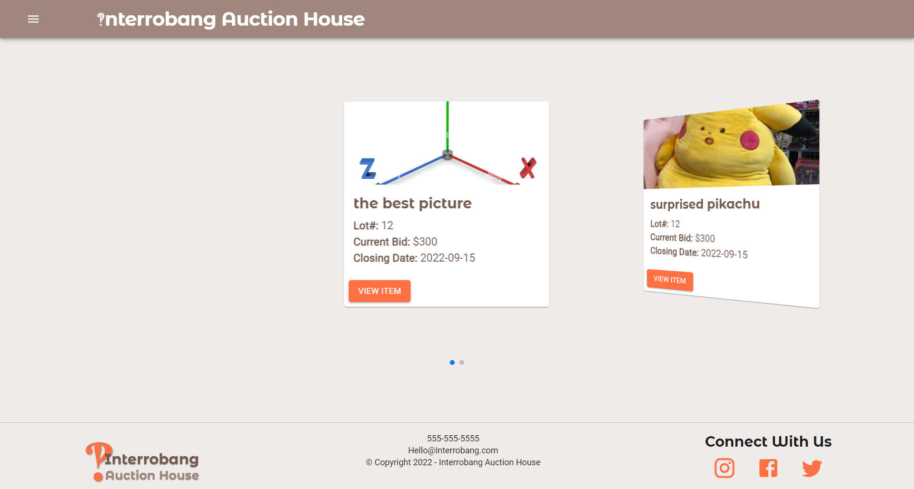

# ‽Interrobang Auction House

## Table of Contents
- [Description](#description)
- [Developers](#developers)
- [Installation](#installation)
- [Usage](#usage)
- [Application](#application)
- [images](#images)
- [questions](#questions)
- [Contributing](#contributing)
- [License](#license)
- [Copyright](#copyright)

## Description
- Are you looking to offload those priceless pieces of art you just aquired from the walls of a museum?
Welcome to Interrobang Auction house where we will help you offload those masterpieces in style.

## Developers
- https://github.com/RGarrettLee/
- https://github.com/SachMilan
- https://github.com/DLittlefield81/

## Installation
Follow these steps to install this project on your local machine.
- Open Bash editor
- mkdir Interrobang-Auction-House
- cd Interrobang-Auction-House
- git clone https://github.com/RGarrettLee/Interrobang-Auction-House.git
- npm install
- npm run seed
- npm run develop

## Usage
- After cloning this repository...
- Production mode: npm run build
- Developer mode: npm run develop

## Application
- Link to Deployed Application: https://interrobang-auction-house.herokuapp.com/

## Images
- -

## Questions
- Contact our team if you have any questions.
- https://github.com/RGarrettLee/
- https://github.com/SachMilan
- https://github.com/DLittlefield81/

## Contributing
- If you would like to contribute...
- Email Us

## License
   This project is licenses under the General Public License v3.0 license.

## Copyright
- © Copyright 2022 Interrobang Auction house
